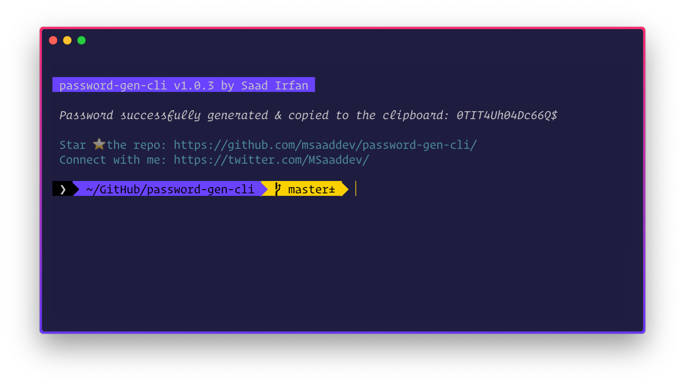

<div align="center">
	<h1>🚀 password-gen-cli<br>
	
	
	
	</h1>
</div>

Tired of thinking new passwords everytime you sign up somewhere!? Don't worry anymore. I got you covered. 😉

## 👉 FEATURES

-   🔑 Generate Random Passwords
-   📋 No need to copy the password. Just press <kbd>⌘ Command </kbd> + <kbd> V </kbd> where you want to paste it.

## 🎩 INSTALLATION

Install the CLI globally. If you are windows user, run your command prompt/terminal as administrator. If you are macOS user, add `sudo` before the following command.

```
npm i -g password-gen-cli
```


## 🏗 USAGE

Run the CLI by typing the following command in your terminal/command prompt. This will generate the password and **copy** it on your clipboard. The only thing you need to do is to **paste** it where you are signing up.

```
pgen
```
A random password will be generated & then will be copied to the clipboard.




## 👨🏻‍💻 AUTHOR

🙋🏻‍♂️ Hola! I am Saad, an undergrad Computer Science student. As a developer I know that how dangerous it is to use same password on every website. So I developed this CLI that can generate random passwords and thus saving you the trouble of thing different passwords over and over again.

👋🏻 Say Hello to me:

-   [Twitter](https://twitter.com/msaaddev)
-   [Facebook](https://www.facebook.com/msaaddev)
-   [Blog](https://msaad.dev)

## 🔑 LICENSE

-   MIT
